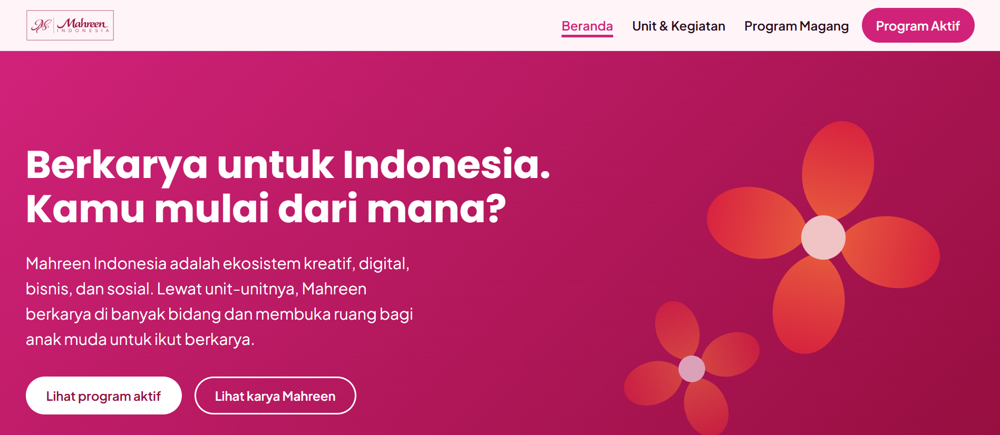

# Mahreen untuk Anak Muda



Website perkenalan Mahreen Indonesia untuk generasi muda, dengan tema **Berkarya untuk Indonesia**.

Kunjungi: **https://mahreen-two.vercel.app/**

## Latar belakang

Website ini dibuat untuk Creative Challenge Mahreen Indonesia Internship Batch 2, posisi Website Development, dengan tema "Berkarya untuk Indonesia".

Informasi tentang Mahreen Indonesia tersebar di lima akun Instagram (@mahreenindonesia, @tanyamahreen, @pedulimahreen, @mahreencsr, dan @mahreenindonesiainternship), sehingga anak muda sulit mendapat gambaran yang utuh. Website ini merangkumnya menjadi satu alur yang mudah diikuti: kenal Mahreen, lihat karyanya, lihat ruang untuk anak muda, lalu ikut berkarya.

## Isi website

| Menu | File | Isi |
|---|---|---|
| Beranda | `index.html` | Siapa Mahreen: visi, misi, ekosistem, dan tautan ke halaman lain. |
| Unit & Kegiatan | `karya.html` | Unit-unit Mahreen (Tanya Mahreen, Peduli Mahreen, Mahreen CSR, Mahreen Studio) beserta jejak karyanya, dan seminar yang diadakan Mahreen. |
| Program Magang | `anak-muda.html` | Program magang: periode Batch 2, benefit, posisi, bidang mentoring, kategori penghargaan Batch 1, dan pilihan bidang minat. |
| Program Aktif | `program-aktif.html` | Status terbaru program yang sedang berjalan dan cara ikut atau memantaunya. |

## Fitur utama

- **Pilihan bidang minat** di halaman Program Magang. Pembaca memilih bidang (misalnya teknologi dan website), lalu melihat posisi magang yang berkaitan, ketersediaan mentor di Batch 2, dan penghargaan Batch 1 untuk posisi tersebut. Pilihan tersimpan di alamat halaman (misalnya `anak-muda.html?minat=teknologi`), jadi hasilnya bisa dibagikan.
- **Daftar program aktif** dengan label status yang tertulis jelas, cara ikut atau memantau, dan tautan ke akun terkait.
- **Keterangan sumber** berupa akun dan tanggal unggahan di setiap fakta penting, dengan tautan ke Instagram.
- **Alur baca berurutan.** Bagian Jelajahi di Beranda dan tombol "Lanjut" di akhir setiap halaman menuntun pembaca ke halaman berikutnya.
- **Navigasi yang menyesuaikan layar.** Header tetap terlihat saat halaman digulir. Di layar kecil, navigasi dilipat di balik tombol "Menu", dan header menyingkir saat pembaca menggulir ke bawah.
- **Footer** berisi lima akun resmi Mahreen beserta fungsinya dan kontak resmi.
- **Tetap terbaca tanpa JavaScript.** Header, navigasi, judul, dan footer ditulis langsung di HTML.

## Keputusan desain

- **Multi-halaman.** Satu halaman untuk satu tujuan, jadi pembaca yang hanya mencari info magang bisa langsung ke halaman Program Magang. Setiap halaman juga punya alamat, judul, dan deskripsi sendiri, sehingga mudah dibagikan per topik.
- **Identitas visual mengikuti Mahreen.** Warna magenta, crimson, dan kelopak oranye diambil dari gaya kampanye Mahreen, bersama logo resmi, motif bunga empat kelopak, dan penanda "# Berkarya untuk Indonesia" seperti di postingan Mahreen. Semua warna diatur di `css/tokens.css`.
- **Tipografi.** Poppins untuk judul dan Plus Jakarta Sans untuk teks, dengan skala ukuran kelipatan 1,25 dan panjang baris yang dibatasi supaya nyaman dibaca.
- **Aksesibilitas.** HTML semantik, skip link, navigasi keyboard dengan garis fokus yang terlihat, dan teks alternatif pada logo. Pilihan minat memakai radio button bawaan HTML, dan animasi dimatikan untuk pengguna yang mengaktifkan `prefers-reduced-motion`.
- **Konten dipisah di `js/data.js`.** Semua teks dan fakta ada di satu file, jadi konten bisa diperbarui tanpa menyentuh HTML atau CSS. Formatnya file JavaScript, bukan JSON, supaya website tetap berjalan saat `index.html` dibuka langsung tanpa server.

## Teknologi

- HTML, CSS, dan JavaScript murni, tanpa framework dan tanpa build tool.
- CSS custom properties sebagai design tokens.
- Google Fonts (Poppins dan Plus Jakarta Sans).
- Di-deploy sebagai situs statis di Vercel.

## Struktur folder

```
/
├─ index.html           Beranda
├─ karya.html           Unit & Kegiatan
├─ anak-muda.html       Program Magang
├─ program-aktif.html   Program Aktif
├─ css/
│  ├─ tokens.css        warna, huruf, jarak, dan gerak
│  ├─ base.css          gaya dasar dan tata letak
│  └─ components.css    komponen setiap halaman
├─ js/
│  ├─ data.js           semua konten (objek MAHREEN)
│  └─ main.js           menampilkan konten dan mengatur interaksi
├─ assets/
│  ├─ logo/             logo resmi versi crimson dan putih
│  ├─ favicon.svg
│  ├─ og-image.png      gambar pratinjau saat tautan dibagikan
│  └─ preview.png       tangkapan layar Beranda untuk README
├─ .gitignore
└─ README.md
```

## Cara menjalankan

Tidak perlu instalasi. Unduh atau clone repo ini, lalu buka `index.html` langsung di browser.

## Cara memperbarui konten

Semua konten ada di objek `MAHREEN` di `js/data.js`. Kuncinya dikelompokkan per bagian: `profil`, `unit`, `kegiatanBersama`, `internship`, `programBerjalan`, `minat`, `akun`, dan `kontak`.

Contoh: memperbarui status sebuah program di halaman Program Aktif.

```js
"programBerjalan": [
  {
    "nama": "Mahreen Indonesia Internship",
    "statusLabel": "Tulis status terbaru di sini",
    ...
    "sumber": {
      "label": "@namaakun, tanggal unggahan",
      "url": "tautan unggahan"
    }
  }
]
```

Setiap fakta sebaiknya disertai `sumber` berisi akun, tanggal, dan tautan unggahannya. Setelah memperbarui `programBerjalan`, ubah juga tanggal pada kalimat "Info terakhir diperbarui ..." di `program-aktif.html`.

## Sumber informasi dan catatan

- Website ini adalah prototype dan bukan website resmi Mahreen Indonesia.
- Informasi dirangkum dari unggahan publik Instagram Mahreen Indonesia, Mei sampai September 2026. Untuk informasi terbaru, cek akun resmi Mahreen Indonesia.
- Logo Mahreen Indonesia dan unit-unitnya digunakan atas izin admin Mahreen Indonesia.

## Pembuat

- Sandhika Hamzah, Universitas Gunadarma
- GitHub: [github.com/rinesro](https://github.com/rinesro)
